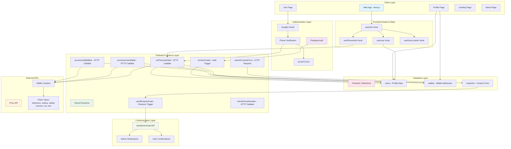

# SIA Modern - System Architecture

## Overview

SIA Modern is a comprehensive web application built with modern technologies to provide secure authentication and multi-chain wallet management. The system follows a serverless architecture pattern using Firebase services with a Next.js frontend.

## Architecture Diagram



## System Components

### 1. Frontend Layer (Next.js)

#### Pages & Components
- **Landing Page** (`/`): Marketing homepage with hero section, features, and contact form
- **Join Page** (`/join`): Authentication flow with Google OAuth and phone verification
- **Profile Page** (`/profile`): User dashboard displaying wallets and account information
- **About Page** (`/about`): Company information and team details

#### Custom Hooks
- **`useAuth`**: Basic Firebase authentication state management
- **`useUser`**: Comprehensive user profile and wallet data management
- **`usePhoneAuth`**: Phone verification flow with reCAPTCHA integration
- **`useGeoLocation`**: Location services for enhanced user experience

### 2. Authentication Layer (Firebase Auth)

#### Authentication Methods
- **Google OAuth**: Primary authentication method (Apple & Facebook disabled)
- **Phone Verification**: Required secondary verification using SMS + reCAPTCHA
- **Multi-factor Flow**: Google → Phone → Wallet Creation

#### Security Features
- Invisible reCAPTCHA for phone verification
- Rate limiting on authentication attempts
- Secure token validation for all function calls

### 3. Backend Layer (Firebase Functions)

#### Authentication Triggers
- **`onUserCreate`**: Triggered when new user registers via Google OAuth
  - Creates initial user profile in Firestore
  - Sets up user metadata and tracking

#### HTTP Callable Functions
- **`onPhoneVerified`**: Handles phone verification completion
  - Links phone number to user account
  - Triggers automatic wallet creation
  - Updates user verification status

- **`checkPhoneNumber`**: Validates if user has verified phone number
  - Used for conditional UI rendering
  - Prevents duplicate verification flows

- **`provisionUserWallet`**: Creates single wallet for specific chain
  - Individual wallet creation with error handling
  - Idempotent operations using phone + chain keys

- **`provisionAllWallets`**: Creates all supported wallets in parallel
  - Batch wallet creation for efficiency
  - Comprehensive error handling and logging

#### HTTP Request Functions
- **`submitContactForm`**: Handles contact form submissions
  - Rate limiting by IP address
  - Input validation and sanitization
  - Metadata collection for analytics

#### Firestore Triggers
- **`sendEnquiryEmail`**: Triggered on new contact form submissions
  - Sends notifications to admin team
  - Sends confirmation emails to users
  - Updates submission status

### 4. External Integrations

#### Privy API
- **Wallet Creation**: Server-side wallet generation for 6 blockchain networks
- **Supported Chains**: Ethereum, Solana, Stellar, Cosmos, Sui, Tron
- **Idempotency**: Uses phone number + chain type as unique keys
- **Error Handling**: Comprehensive retry logic and failure reporting

#### SendGrid Email API
- **Transactional Emails**: Contact form notifications and confirmations
- **Template Management**: HTML email templates for different scenarios
- **Delivery Tracking**: Success/failure status monitoring

### 5. Database Layer (Firestore)

#### Collections Structure

##### `users` Collection
```typescript
{
  uid: string,                    // Firebase Auth UID
  email: string,                  // User email from Google OAuth
  displayName: string,            // Display name from Google OAuth
  photoURL: string,               // Profile picture URL
  phoneNumber: {                  // Phone verification data
    number: string,
    verified: boolean,
    verifiedAt: Timestamp
  },
  authProviders: string[],        // ["google.com"]
  walletsStatus: string,          // "creating" | "completed" | "failed"
  createdAt: Timestamp,
  updatedAt: Timestamp
}
```

##### `wallets` Collection
```typescript
{
  uid: string,                    // Firebase Auth UID
  chainType: string,              // "ethereum" | "solana" | etc.
  address: string,                // Wallet address
  privyWalletId: string,          // Privy wallet identifier
  createdAt: Timestamp,
  idempotencyKey: string          // "{phoneNumber}-{chainType}"
}
```

##### `enquiries` Collection
```typescript
{
  name: string,
  email: string,
  inquiryType: string,
  message: string,
  status: string,                 // "new" | "email_sent" | "email_failed"
  timestamp: Timestamp,
  metadata: {                     // Request metadata
    ipAddress: string,
    userAgent: string,
    country: string,
    // ... other metadata
  }
}
```

#### Security Rules
- **User Data**: Users can only read/write their own profile data
- **Wallets**: Read-only access for users, write access only for Cloud Functions
- **Enquiries**: No direct client access, functions-only operations

## Data Flow Patterns

### 1. User Registration Flow
```
Google OAuth → onUserCreate Function → User Profile Creation → Phone Verification Required
```

### 2. Phone Verification Flow
```
Phone Input → reCAPTCHA → SMS Verification → onPhoneVerified Function → Wallet Creation Trigger
```

### 3. Wallet Creation Flow
```
Phone Verified → provisionAllWallets Function → Privy API Calls → Firestore Wallet Storage → UI Update
```

### 4. Contact Form Flow
```
Form Submission → submitContactForm Function → Firestore Storage → sendEnquiryEmail Trigger → Email Notifications
```

## Technical Specifications

### Frontend Stack
- **Framework**: Next.js 14 with App Router
- **Styling**: Tailwind CSS with custom creative-tech theme
- **State Management**: React hooks with Firebase SDK
- **Authentication**: Firebase Auth SDK
- **Icons**: Lucide React + Custom SVG components

### Backend Stack
- **Runtime**: Node.js on Firebase Functions (Gen 1)
- **Database**: Cloud Firestore with security rules
- **Authentication**: Firebase Auth with custom claims
- **External APIs**: Privy Wallet API, SendGrid Email API
- **Monitoring**: Firebase Functions logging

### Development Tools
- **Monorepo**: Turborepo with pnpm workspaces
- **TypeScript**: Full type safety across frontend and backend
- **ESLint**: Code quality and consistency
- **Deployment**: Firebase CLI with custom deployment scripts

## Security Considerations

### Authentication Security
- Google OAuth with verified email requirements
- Phone verification with SMS and reCAPTCHA
- Rate limiting on authentication attempts
- Secure token validation for all function calls

### Data Protection
- Firestore security rules preventing unauthorized access
- Wallet addresses stored separately from user profiles
- Sensitive operations restricted to Cloud Functions
- Input validation and sanitization on all endpoints

### API Security
- CORS configuration for authorized origins
- Request metadata logging for security monitoring
- Rate limiting on contact form submissions
- Error handling that doesn't expose sensitive information

## Deployment Architecture

### Environment Separation
- **Development**: Local Firebase emulators
- **Production**: Firebase hosting and functions

### Deployment Scripts
- `deploy.sh`: Full deployment (hosting + functions)
- `deploy-hosting-only.sh`: Frontend-only deployment
- `deploy-functions.sh`: Backend-only deployment
- `dev.sh`: Local development with emulators

### Monitoring & Logging
- Firebase Functions logs for backend monitoring
- Client-side error tracking for frontend issues
- Email delivery status tracking
- Wallet creation success/failure metrics

## Performance Optimizations

### Frontend Optimizations
- Next.js automatic code splitting
- Image optimization with Next.js Image component
- Lazy loading for non-critical components
- Efficient React hooks for state management

### Backend Optimizations
- Parallel wallet creation for reduced latency
- Firestore batch operations for atomic updates
- Function memory allocation based on workload
- Idempotent operations to prevent duplicates

### Database Optimizations
- Composite indexes for efficient queries
- Document structure optimized for read patterns
- Minimal data fetching in client applications
- Offline-first approach with Firestore SDK

## Scalability Considerations

### Horizontal Scaling
- Firebase Functions auto-scale based on demand
- Firestore handles concurrent operations automatically
- CDN distribution via Firebase Hosting
- External API rate limiting and retry logic

### Performance Monitoring
- Function execution time tracking
- Database query performance monitoring
- Email delivery success rates
- Wallet creation completion rates

This architecture provides a robust, scalable foundation for the SIA Modern application while maintaining security, performance, and user experience standards. 