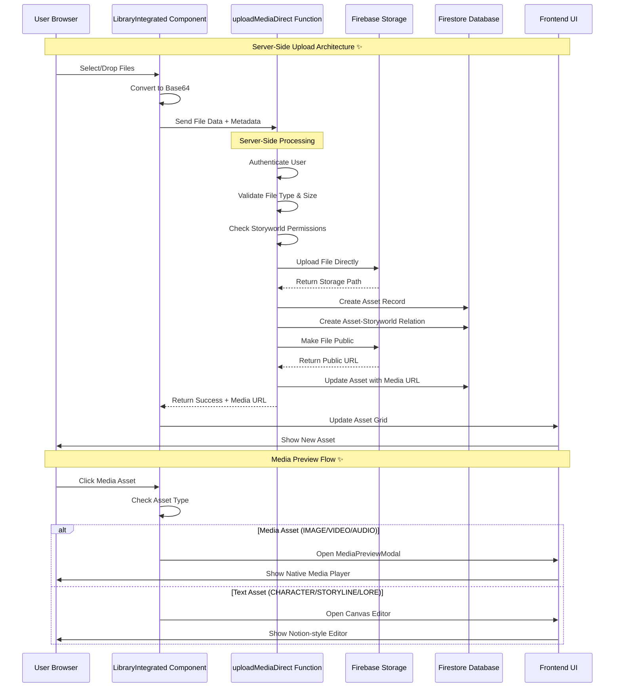
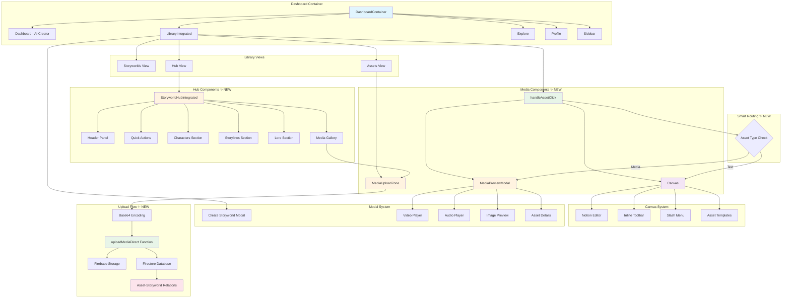

# SIA Modern - System Architecture

## Overview

SIA Modern is a comprehensive story creation and publishing platform with integrated Web3 identity management. The system follows a serverless architecture pattern using Firebase services with a modern Next.js frontend featuring a dashboard-centric design.

## Architecture Diagram

```mermaid
graph TB
    subgraph "Frontend Layer"
        A[Web App - Next.js]
        A1[Landing Page]
        A2[Join Page - OAuth & Phone Auth]
        A3[Dashboard - Story Creation Hub]
        A4[About Page]
    end
    
    subgraph "Dashboard Components"
        D1[DashboardContainer - Main Container]
        D2[Dashboard - AI Story Creator]
        D3[LibraryIntegrated - Collections Management]
        D4[StoryworldHubIntegrated - Detailed Workspace]
        D5[Canvas - Notion-style Editor]
        D6[Profile - User & Wallets]
        D7[Sidebar - Navigation]
    end
    
    subgraph "Media Components ✨ NEW"
        M1[MediaUploadZone - Drag & Drop]
        M2[MediaPreviewModal - Smart Preview]
        M3[Asset Click Handler - Smart Routing]
    end
    
    subgraph "Authentication Layer"
        B[Firebase Auth]
        B1[Google OAuth]
        B2[Phone Verification]
        B3[reCAPTCHA]
    end
    
    subgraph "Upload Architecture ✨ NEW"
        U1[Browser File Selection]
        U2[Base64 Encoding]
        U3[uploadMediaDirect Function]
        U4[Server-side Validation]
        U5[Firebase Storage Upload]
        U6[Firestore Asset Creation]
        U7[Asset-Storyworld Relationship]
        U8[Public URL Generation]
    end
    
    subgraph "Firebase Functions Layer"
        F[Cloud Functions]
        F1[Authentication Functions]
        F2[Wallet Management]
        F3[Story & Asset Management - UPDATED]
        F4[Media Upload Functions - NEW]
        F5[Communication Functions]
    end
    
    subgraph "Story Management Functions - UPDATED"
        S1[createStoryworld]
        S2[getUserStoryworlds]
        S3[saveAsset]
        S4[getAssetById]
        S5[getStoryworldAssets - Rewritten]
        S6[deleteStoryworld]
    end
    
    subgraph "Media Functions ✨ NEW"
        MF1[uploadMediaDirect - Server Upload]
        MF2[processUploadedMedia - Schema Fixed]
        MF3[confirmAssetRegistration - Schema Fixed]
        MF4[deleteAsset - Schema Fixed]
    end
    
    subgraph "External APIs"
        E[Privy API]
        E1[Wallet Creation]
        E2[Chain Types:<br/>ethereum, solana, stellar,<br/>cosmos, sui, tron]
    end
    
    subgraph "Database Layer - Schema Aligned"
        G[Firestore Collections]
        G1[users - Profile Data]
        G2[wallets - Wallet Addresses]
        G3[storyworlds - Story Containers]
        G4[assets - Story Elements - UPDATED Schema]
        G5[asset-storyworld-relations - NEW]
        G6[enquiries - Contact Form]
    end
    
    subgraph "Storage Layer ✨ NEW"
        ST[Firebase Storage]
        ST1[Media Files]
        ST2[Public URLs]
        ST3[Direct Function Upload]
    end
    
    subgraph "Communication Layer"
        H[SendGrid Email API]
        H1[Admin Notifications]
        H2[User Confirmations]
    end
    
    %% Client to Dashboard Flow
    A1 --> A2
    A2 --> A3
    A3 --> D1
    D1 --> D2
    D1 --> D3
    D1 --> D4
    D1 --> D5
    D1 --> D6
    D1 --> D7
    
    %% Media Component Flow
    D3 --> M1
    D4 --> M1
    M1 --> U1
    D3 --> M3
    D4 --> M3
    M3 --> M2
    M3 --> D5
    
    %% Upload Flow ✨ NEW
    U1 --> U2
    U2 --> U3
    U3 --> U4
    U4 --> U5
    U5 --> U6
    U6 --> U7
    U7 --> U8
    U8 --> D3
    
    %% Auth to Functions
    A2 --> B1
    B1 --> B2
    B2 --> B3
    B --> F1
    
    %% Dashboard to Story Functions
    D2 --> S1
    D3 --> S2
    D3 --> S3
    D3 --> S4
    D3 --> S5
    D3 --> S6
    
    %% Media Functions Integration
    U3 --> MF1
    MF1 --> MF2
    MF1 --> MF3
    S6 --> MF4
    
    %% Functions to External APIs
    F2 --> E1
    E1 --> E2
    
    %% Functions to Database
    F1 --> G1
    F2 --> G2
    F3 --> G3
    F3 --> G4
    F4 --> G4
    F4 --> G5
    F5 --> G6
    
    %% Storage Integration
    MF1 --> ST
    ST --> ST1
    ST1 --> ST2
    MF1 --> ST3
    
    %% Database Triggers
    G6 --> H
    H --> H1
    H --> H2
    
    %% Client Data Flow
    D6 --> G1
    D6 --> G2
    D3 --> G3
    D3 --> G4
    D4 --> G5
    
    style A fill:#e1f5fe
    style B fill:#f3e5f5
    style D1 fill:#e8f5e8
    style M1 fill:#fff3e0
    style M2 fill:#fff3e0
    style U3 fill:#e8f5e8
    style F fill:#e8f5e8
    style MF1 fill:#fff3e0
    style S5 fill:#fce4ec
    style E fill:#fff3e0
    style G fill:#fce4ec
    style G5 fill:#fff3e0
    style ST fill:#f1f8e9
    style H fill:#f1f8e9
```



## System Components

### 1. Frontend Layer (Next.js)

#### Pages & Components
- **Landing Page** (`/`): Marketing homepage with hero section, features, and contact form
- **Join Page** (`/join`): Authentication flow with Google OAuth and phone verification that redirects to dashboard
- **Dashboard Page** (`/dashboard`): Main authenticated workspace with modern story creation interface
- **About Page** (`/about`): Company information and team details

#### Dashboard Architecture
- **DashboardContainer**: Main container component managing state and navigation  
- **Dashboard**: ChatGPT-style story creation interface with AI prompts and quick actions
- **LibraryIntegrated**: Enhanced collections management with three view modes:
  - **Storyworlds View**: Grid of story containers with creation flow
  - **Hub View**: Detailed storyworld interface with asset organization ✨ NEW
  - **Assets View**: All assets grid with upload functionality
- **StoryworldHubIntegrated**: Detailed storyworld workspace ✨ NEW
  - **Asset Organization**: Characters, Storylines, Lore, Media Gallery sections
  - **Quick Actions Panel**: Direct access to asset creation and storyline building
  - **Real-time Stats**: Dynamic asset counts and activity metrics
  - **Integrated Creation**: Direct Canvas access for storyline creation
- **Canvas**: Notion-style editor with slash commands and inline formatting
- **Explore**: Community discovery and publishing features
- **Profile**: User profile with wallet display and phone verification
- **Sidebar**: Navigation component with user profile section and tab switching

#### Custom Hooks
- **`useAuth`**: Basic Firebase authentication state management
- **`useUser`**: Comprehensive user profile and wallet data management
- **`usePhoneAuth`**: Phone verification flow with reCAPTCHA integration
- **`useGeoLocation`**: Location services for enhanced user experience

### 2. Authentication Layer (Firebase Auth)

#### Authentication Methods
- **Google OAuth**: Primary authentication method (Apple & Facebook disabled)
- **Phone Verification**: Required secondary verification using SMS + reCAPTCHA
- **Multi-factor Flow**: Google → Phone → Dashboard Redirect

#### Security Features
- Invisible reCAPTCHA for phone verification
- Rate limiting on authentication attempts
- Secure token validation for all function calls

### 3. Backend Layer (Firebase Functions)

#### Authentication Functions
- **`onUserCreate`**: Triggered when new user registers via Google OAuth
  - Creates initial user profile in Firestore
  - Sets up user metadata and tracking

- **`onPhoneVerified`**: Handles phone verification completion
  - Links phone number to user account
  - Triggers automatic wallet creation
  - Updates user verification status

- **`checkPhoneNumber`**: Validates if user has verified phone number
  - Used for conditional UI rendering
  - Prevents duplicate verification flows

#### Wallet Management Functions
- **`provisionUserWallet`**: Creates single wallet for specific chain
  - Individual wallet creation with error handling
  - Idempotent operations using phone + chain keys

- **`provisionAllWallets`**: Creates all supported wallets in parallel
  - Batch wallet creation for efficiency
  - Comprehensive error handling and logging

#### Story & Asset Management Functions
- **`createStoryworld`**: Creates new story container with metadata
  - Generates unique storyworld IDs
  - Sets up initial permissions and ownership
  - Returns structured storyworld data

- **`getUserStoryworlds`**: Retrieves all storyworlds for authenticated user
  - Filters by user ownership and permissions
  - Returns paginated results with metadata
  - Includes asset counts and activity stats

- **`saveAsset`**: Creates or updates story assets (characters, lore, storylines)
  - Validates asset data structure and permissions
  - Creates asset-storyworld relationships
  - Handles versioning and change tracking

- **`getAssetById`**: Retrieves specific asset by ID
  - Validates user permissions for asset access
  - Returns complete asset data with relationships
  - Handles asset privacy and sharing settings

- **`getStoryworldAssets`**: Retrieves all assets for a specific storyworld  
  - Uses relationship-based queries for scalability
  - Supports filtering by asset type and status
  - Handles batch loading for large asset collections
  - **UPDATED**: Complete rewrite to use asset-storyworld relationships

- **`deleteStoryworld`**: Removes storyworld and associated assets
  - Cascading deletion of related assets and relationships
  - Preserves user data integrity
  - Handles rollback on partial failures

#### Media Upload Functions ✨ NEW
- **`uploadMediaDirect`**: Server-side media upload processing
  - Accepts base64-encoded file data from browser
  - Validates file type, size, and user permissions
  - Uploads directly to Firebase Storage from server
  - Creates asset record and storyworld relationship
  - Makes file public and returns accessible URL
  - Comprehensive error handling and logging

- **`processUploadedMedia`**: Post-upload processing (UPDATED)
  - **Schema Fix**: Uses `uploadedBy` instead of `ownerId`
  - Handles metadata extraction and optimization
  - Creates thumbnails and previews where applicable

- **`confirmAssetRegistration`**: IP registration confirmation (UPDATED)
  - **Schema Fix**: Uses `uploadedBy` instead of `ownerId`
  - Updates asset status after blockchain registration
  - Handles registration webhooks and notifications

- **`deleteAsset`**: Asset removal function (UPDATED)
  - **Schema Fix**: Uses `uploadedBy` instead of `ownerId`
  - Removes from Storage and Firestore
  - Cleans up asset-storyworld relationships

#### Communication Functions
- **`submitContactForm`**: Handles contact form submissions
  - Rate limiting by IP address
  - Input validation and sanitization
  - Metadata collection for analytics

#### Firestore Triggers
- **`sendEnquiryEmail`**: Triggered on new contact form submissions
  - Sends notifications to admin team
  - Sends confirmation emails to users
  - Updates submission status

### 4. External Integrations

#### Privy API
- **Wallet Creation**: Server-side wallet generation for 6 blockchain networks
- **Supported Chains**: Ethereum, Solana, Stellar, Cosmos, Sui, Tron
- **Idempotency**: Uses phone number + chain type as unique keys
- **Error Handling**: Comprehensive retry logic and failure reporting

#### SendGrid Email API
- **Transactional Emails**: Contact form notifications and confirmations
- **Template Management**: HTML email templates for different scenarios
- **Delivery Tracking**: Success/failure status monitoring

### 5. Database Layer (Firestore)

#### Collections Structure ✨ UPDATED

**`users` Collection**
- User profile information and metadata
- Phone number verification status and linking
- Authentication provider information (Google, etc.)
- Wallet creation status tracking with `walletsStatus` field
- Geographic and preference data

**`wallets` Collection**
- Individual wallet addresses by chain type
- **Security**: Only Firebase Functions can write to this collection
- Atomic batch operations ensure consistency
- Idempotent creation using phone + chain type keys

**`storyworlds` Collection**
- Story container metadata and ownership
- Creation timestamps and activity tracking
- Asset count statistics and relationships
- Publishing status and sharing permissions

**`assets` Collection ✨ SCHEMA UPDATED**
- Story elements: characters, lore, storylines, media files
- **Schema Fix**: Uses `uploadedBy` field instead of `ownerId` for consistency
- Media metadata: file size, MIME type, storage URLs
- IP registration status and blockchain tracking
- Version control and edit history

**`asset-storyworld-relations` Collection ✨ NEW**
- Links assets to their parent storyworlds
- Enables efficient querying and relationship management
- Supports many-to-many relationships for shared assets
- Handles permissions and access control

**`enquiries` Collection**
- Contact form submissions and admin communications
- Automated email trigger integration
- Response tracking and status management

### 6. Security & Access Control

#### Firestore Security Rules
- **User Data**: Users can only read/write their own profile data
- **Wallet Data**: Read-only access to own wallet information
- **Story Data**: Full CRUD access to own storyworlds and assets
- **Enquiries**: Write-only access for contact form submissions

#### Function Security
- **Authentication Required**: All story and wallet functions require valid Firebase Auth token
- **Ownership Validation**: Functions verify user ownership before data access
- **Rate Limiting**: Contact forms and resource-intensive operations are rate-limited

### 7. Performance Optimizations

#### Database Indexing
- **User Stories**: Composite index on (ownerId, updatedAt) for efficient queries
- **Asset Filtering**: Indexes on (storyworldId, type, status) for library filtering
- **IP Status Tracking**: Index on (ownerId, ipStatus) for blockchain registration queries

#### Caching Strategy
- **Frontend**: Next.js static generation and client-side caching
- **Database**: Firestore automatic caching and offline support
- **Functions**: Cloud Functions automatic scaling and connection pooling

## Data Flow Patterns

### 1. Authentication Flow
```
Landing Page → Join Page → Google OAuth → Phone Verification → Dashboard
```

### 2. Story Creation Flow
```
Dashboard → AI Prompt Input → Asset Creation → Library Storage → Publishing
```

### 3. Wallet Creation Flow
```
Phone Verification → Background Wallet Creation → Profile Display
```

### 4. Collection Management Flow
```
Library → Create/Edit Collections → Asset Management → Publishing → Community Sharing
```

## Technology Stack

### Frontend Technologies
- **Next.js 14**: App Router with React Server Components
- **React 18**: Latest React with concurrent features
- **TypeScript**: Full type safety across the application
- **Tailwind CSS**: Utility-first styling with custom design system
- **Firebase SDK**: Authentication and real-time database integration

### Backend Technologies
- **Firebase Functions**: Serverless compute with automatic scaling
- **Node.js 20**: Latest LTS runtime environment
- **TypeScript**: Type-safe server-side development
- **Firestore**: NoSQL document database with real-time updates

### Development Tools
- **Turborepo**: Monorepo build system with intelligent caching
- **pnpm Workspaces**: Efficient package management
- **ESLint & Prettier**: Code quality and formatting
- **Firebase CLI**: Development, testing, and deployment tools

### External Services
- **Privy**: Enterprise wallet infrastructure
- **SendGrid**: Transactional email delivery
- **Google Cloud**: Firebase hosting and computing infrastructure

## Deployment Architecture

### Production Environment
- **Frontend**: Firebase Hosting with global CDN
- **Backend**: Firebase Functions with auto-scaling
- **Database**: Firestore with multi-region replication
- **Authentication**: Firebase Auth with social providers

### Development Environment
- **Local Development**: Firebase emulators for offline development
- **Hot Reloading**: Next.js dev server with instant updates
- **Type Checking**: Real-time TypeScript validation
- **Testing**: Firebase emulator suite for function testing

## Security Considerations

### Data Protection
- **Encryption**: All data encrypted in transit and at rest
- **Authentication**: Multi-factor authentication required
- **Authorization**: Role-based access control with Firestore rules
- **Input Validation**: Server-side validation and sanitization

### Privacy Compliance
- **Data Minimization**: Only collect necessary user information
- **User Control**: Users own and control their story data
- **Secure Storage**: Personal data stored with Firebase's enterprise security
- **Audit Logging**: Comprehensive logging for security monitoring

#### Media Components ✨ NEW
- **MediaUploadZone**: Drag & drop upload interface
  - **Server-side Processing**: Files processed through Firebase Functions
  - **Progress Tracking**: Real-time upload progress with batch support
  - **Validation**: File type, size, and permission checks
- **MediaPreviewModal**: Smart asset preview system
  - **Native Players**: HTML5 video, audio, and image viewers
  - **Asset Details**: File metadata, IP status, creation info
  - **Smart Routing**: Media preview vs Canvas editing based on asset type
  - **Context Actions**: "Open in New Tab" and "Edit in Canvas" options 

## Upload Flow Architecture ✨ NEW

The following sequence diagram shows the complete server-side upload process and smart media preview system:



## Component Architecture ✨ NEW

The following diagram shows the enhanced component hierarchy with new media handling capabilities:

