# SIA Modern - System Architecture

## Overview

SIA Modern is a comprehensive story creation and publishing platform with integrated Web3 identity management. The system follows a serverless architecture pattern using Firebase services with a modern Next.js frontend featuring a dashboard-centric design.

## Architecture Diagram

```mermaid
graph TB
    subgraph "Client Layer"
        A[Web App - Next.js]
        A1[Landing Page]
        A2[Join Page - OAuth & Phone Auth]
        A3[Dashboard - Story Creation Hub]
        A4[About Page]
    end
    
    subgraph "Dashboard Components"
        D1[StoryForge - Main Container]
        D2[Dashboard - AI Story Creator]
        D3[Library - Collections Management]
        D4[Profile - User & Wallets]
        D5[Sidebar - Navigation]
    end
    
    subgraph "Authentication Layer"
        B[Firebase Auth]
        B1[Google OAuth]
        B2[Phone Verification]
        B3[reCAPTCHA]
    end
    
    subgraph "Frontend Hooks & State"
        C[useAuth Hook]
        C1[useUser Hook]
        C2[usePhoneAuth Hook]
        C3[useGeoLocation Hook]
    end
    
    subgraph "Firebase Functions Layer"
        F[Cloud Functions]
        F1[Authentication Functions]
        F2[Wallet Management]
        F3[Story & Asset Management]
        F4[Communication Functions]
    end
    
    subgraph "Story Management Functions"
        S1[createStoryworld]
        S2[getUserStoryworlds]
        S3[saveAsset]
        S4[getAssetById]
        S5[getStoryworldAssets]
        S6[deleteStoryworld]
    end
    
    subgraph "External APIs"
        E[Privy API]
        E1[Wallet Creation]
        E2[Chain Types:<br/>ethereum, solana, stellar,<br/>cosmos, sui, tron]
    end
    
    subgraph "Database Layer"
        G[Firestore Collections]
        G1[users - Profile Data]
        G2[wallets - Wallet Addresses]
        G3[storyworlds - Story Containers]
        G4[assets - Story Elements]
        G5[enquiries - Contact Form]
    end
    
    subgraph "Communication Layer"
        H[SendGrid Email API]
        H1[Admin Notifications]
        H2[User Confirmations]
    end
    
    %% Client to Dashboard Flow
    A1 --> A2
    A2 --> A3
    A3 --> D1
    D1 --> D2
    D1 --> D3
    D1 --> D4
    D1 --> D5
    
    %% Auth to Functions
    A2 --> B1
    B1 --> B2
    B2 --> B3
    B --> F1
    
    %% Hooks Integration
    A --> C
    C --> C1
    C --> C2
    C --> C3
    
    %% Dashboard to Story Functions
    D2 --> S1
    D3 --> S2
    D3 --> S3
    D3 --> S4
    D3 --> S5
    D3 --> S6
    
    %% Functions to External APIs
    F2 --> E1
    E1 --> E2
    
    %% Functions to Database
    F1 --> G1
    F2 --> G2
    F3 --> G3
    F3 --> G4
    F4 --> G5
    
    %% Database Triggers
    G5 --> H
    H --> H1
    H --> H2
    
    %% Client Data Flow
    C1 --> G1
    C2 --> F1
    D4 --> G1
    D4 --> G2
    D3 --> G3
    D3 --> G4
    
    style A fill:#e1f5fe
    style B fill:#f3e5f5
    style D1 fill:#e8f5e8
    style F fill:#e8f5e8
    style S1 fill:#fff3e0
    style E fill:#fff3e0
    style G fill:#fce4ec
    style H fill:#f1f8e9
```



## System Components

### 1. Frontend Layer (Next.js)

#### Pages & Components
- **Landing Page** (`/`): Marketing homepage with hero section, features, and contact form
- **Join Page** (`/join`): Authentication flow with Google OAuth and phone verification that redirects to dashboard
- **Dashboard Page** (`/dashboard`): Main authenticated workspace with modern story creation interface
- **About Page** (`/about`): Company information and team details

#### Dashboard Architecture
- **StoryForge**: Main container component managing state and navigation
- **Dashboard**: ChatGPT-style story creation interface with AI prompts and quick actions
- **Library**: Collections management with publishing workflow and beautiful card interface
- **Profile**: User profile with wallet display and phone verification
- **Sidebar**: Navigation component with user profile section and tab switching

#### Custom Hooks
- **`useAuth`**: Basic Firebase authentication state management
- **`useUser`**: Comprehensive user profile and wallet data management
- **`usePhoneAuth`**: Phone verification flow with reCAPTCHA integration
- **`useGeoLocation`**: Location services for enhanced user experience

### 2. Authentication Layer (Firebase Auth)

#### Authentication Methods
- **Google OAuth**: Primary authentication method (Apple & Facebook disabled)
- **Phone Verification**: Required secondary verification using SMS + reCAPTCHA
- **Multi-factor Flow**: Google → Phone → Dashboard Redirect

#### Security Features
- Invisible reCAPTCHA for phone verification
- Rate limiting on authentication attempts
- Secure token validation for all function calls

### 3. Backend Layer (Firebase Functions)

#### Authentication Functions
- **`onUserCreate`**: Triggered when new user registers via Google OAuth
  - Creates initial user profile in Firestore
  - Sets up user metadata and tracking

- **`onPhoneVerified`**: Handles phone verification completion
  - Links phone number to user account
  - Triggers automatic wallet creation
  - Updates user verification status

- **`checkPhoneNumber`**: Validates if user has verified phone number
  - Used for conditional UI rendering
  - Prevents duplicate verification flows

#### Wallet Management Functions
- **`provisionUserWallet`**: Creates single wallet for specific chain
  - Individual wallet creation with error handling
  - Idempotent operations using phone + chain keys

- **`provisionAllWallets`**: Creates all supported wallets in parallel
  - Batch wallet creation for efficiency
  - Comprehensive error handling and logging

#### Story & Asset Management Functions
- **`createStoryworld`**: Creates new story containers
  - Generates unique storyworld IDs
  - Sets up initial metadata and ownership

- **`getUserStoryworlds`**: Retrieves user's story collections
  - Filtered by ownership for security
  - Optimized for dashboard display

- **`saveAsset`**: Creates/updates story assets (characters, lore, artifacts)
  - Supports both creation and updates
  - Validates asset types and content

- **`getAssetById`**: Retrieves specific story assets
  - Security checks for ownership
  - Used for asset editing and viewing

- **`getStoryworldAssets`**: Gets all assets for a storyworld with filtering
  - Supports type and status filtering
  - Pagination for large collections

- **`deleteStoryworld`**: Removes storyworld and all associated assets
  - Cascading deletion with safety checks
  - Maintains data integrity

#### Communication Functions
- **`submitContactForm`**: Handles contact form submissions
  - Rate limiting by IP address
  - Input validation and sanitization
  - Metadata collection for analytics

#### Firestore Triggers
- **`sendEnquiryEmail`**: Triggered on new contact form submissions
  - Sends notifications to admin team
  - Sends confirmation emails to users
  - Updates submission status

### 4. External Integrations

#### Privy API
- **Wallet Creation**: Server-side wallet generation for 6 blockchain networks
- **Supported Chains**: Ethereum, Solana, Stellar, Cosmos, Sui, Tron
- **Idempotency**: Uses phone number + chain type as unique keys
- **Error Handling**: Comprehensive retry logic and failure reporting

#### SendGrid Email API
- **Transactional Emails**: Contact form notifications and confirmations
- **Template Management**: HTML email templates for different scenarios
- **Delivery Tracking**: Success/failure status monitoring

### 5. Database Layer (Firestore)

#### Collections Structure

##### `users` Collection
```typescript
{
  uid: string,                    // Firebase Auth UID
  email: string,                  // User email from Google OAuth
  displayName: string,            // Display name from Google OAuth
  photoURL: string,               // Profile picture URL
  phoneNumber?: string,           // Verified phone number
  walletsStatus: 'creating' | 'completed' | 'failed',
  createdAt: Timestamp,
  updatedAt: Timestamp
}
```

##### `wallets` Collection
```typescript
{
  userId: string,                 // Reference to user
  chainType: 'ethereum' | 'solana' | 'stellar' | 'cosmos' | 'sui' | 'tron',
  address: string,                // Wallet address
  createdAt: Timestamp,
  status: 'active' | 'inactive'
}
```

##### `storyworlds` Collection
```typescript
{
  id: string,                     // Auto-generated document ID
  ownerId: string,                // User ID who owns this storyworld
  name: string,                   // Display name
  description: string,            // Optional description
  coverImageUrl?: string,         // Optional cover image URL
  createdAt: Timestamp,
  updatedAt: Timestamp
}
```

##### `assets` Collection
```typescript
{
  id: string,                     // Auto-generated document ID
  ownerId: string,                // User ID who owns this asset
  storyworldId: string,           // ID of the parent storyworld
  name: string,                   // Display name
  type: 'CHARACTER' | 'LORE' | 'ARTIFACT' | 'LOCATION' | 'CHAPTER',
  content: object,                // Tiptap JSON content
  status: 'DRAFT' | 'PUBLISHED',
  ipStatus: 'UNREGISTERED' | 'PENDING' | 'REGISTERED',
  onChainId?: string,             // Story Protocol ID or transaction hash
  createdAt: Timestamp,
  updatedAt: Timestamp
}
```

##### `enquiries` Collection
```typescript
{
  id: string,                     // Auto-generated document ID
  name: string,                   // Contact name
  email: string,                  // Contact email
  message: string,                // Enquiry message
  ipAddress?: string,             // Rate limiting
  userAgent?: string,             // Analytics
  status: 'pending' | 'processed',
  createdAt: Timestamp
}
```

### 6. Security & Access Control

#### Firestore Security Rules
- **User Data**: Users can only read/write their own profile data
- **Wallet Data**: Read-only access to own wallet information
- **Story Data**: Full CRUD access to own storyworlds and assets
- **Enquiries**: Write-only access for contact form submissions

#### Function Security
- **Authentication Required**: All story and wallet functions require valid Firebase Auth token
- **Ownership Validation**: Functions verify user ownership before data access
- **Rate Limiting**: Contact forms and resource-intensive operations are rate-limited

### 7. Performance Optimizations

#### Database Indexing
- **User Stories**: Composite index on (ownerId, updatedAt) for efficient queries
- **Asset Filtering**: Indexes on (storyworldId, type, status) for library filtering
- **IP Status Tracking**: Index on (ownerId, ipStatus) for blockchain registration queries

#### Caching Strategy
- **Frontend**: Next.js static generation and client-side caching
- **Database**: Firestore automatic caching and offline support
- **Functions**: Cloud Functions automatic scaling and connection pooling

## Data Flow Patterns

### 1. Authentication Flow
```
Landing Page → Join Page → Google OAuth → Phone Verification → Dashboard
```

### 2. Story Creation Flow
```
Dashboard → AI Prompt Input → Asset Creation → Library Storage → Publishing
```

### 3. Wallet Creation Flow
```
Phone Verification → Background Wallet Creation → Profile Display
```

### 4. Collection Management Flow
```
Library → Create/Edit Collections → Asset Management → Publishing → Community Sharing
```

## Technology Stack

### Frontend Technologies
- **Next.js 14**: App Router with React Server Components
- **React 18**: Latest React with concurrent features
- **TypeScript**: Full type safety across the application
- **Tailwind CSS**: Utility-first styling with custom design system
- **Firebase SDK**: Authentication and real-time database integration

### Backend Technologies
- **Firebase Functions**: Serverless compute with automatic scaling
- **Node.js 20**: Latest LTS runtime environment
- **TypeScript**: Type-safe server-side development
- **Firestore**: NoSQL document database with real-time updates

### Development Tools
- **Turborepo**: Monorepo build system with intelligent caching
- **pnpm Workspaces**: Efficient package management
- **ESLint & Prettier**: Code quality and formatting
- **Firebase CLI**: Development, testing, and deployment tools

### External Services
- **Privy**: Enterprise wallet infrastructure
- **SendGrid**: Transactional email delivery
- **Google Cloud**: Firebase hosting and computing infrastructure

## Deployment Architecture

### Production Environment
- **Frontend**: Firebase Hosting with global CDN
- **Backend**: Firebase Functions with auto-scaling
- **Database**: Firestore with multi-region replication
- **Authentication**: Firebase Auth with social providers

### Development Environment
- **Local Development**: Firebase emulators for offline development
- **Hot Reloading**: Next.js dev server with instant updates
- **Type Checking**: Real-time TypeScript validation
- **Testing**: Firebase emulator suite for function testing

## Security Considerations

### Data Protection
- **Encryption**: All data encrypted in transit and at rest
- **Authentication**: Multi-factor authentication required
- **Authorization**: Role-based access control with Firestore rules
- **Input Validation**: Server-side validation and sanitization

### Privacy Compliance
- **Data Minimization**: Only collect necessary user information
- **User Control**: Users own and control their story data
- **Secure Storage**: Personal data stored with Firebase's enterprise security
- **Audit Logging**: Comprehensive logging for security monitoring 